# APÉRO ROYALE 👑

**La soirée devient une borne d’arcade.** Dix défis Android pour 2 à 6 amis, sur **un seul téléphone** ou **plusieurs téléphones**. À chaque manche, tout le monde touche au jeu : réponses secrètes, parcours piégé, chaîne mémoire, mesure musicale, jury, galerie de dessin ou relais de bombe.

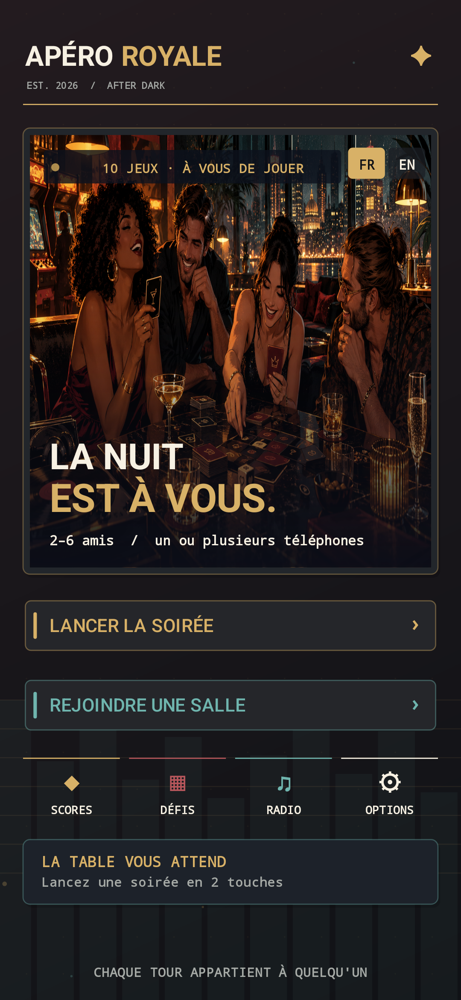

[**Télécharger l’APK signé 1.4.8**](https://raw.githubusercontent.com/nabz0r/AperoRoyal/main/releases/AperoRoyale-v1.4.8.apk) · Android 8.0+ · [Détails de la release](RELEASE.md) · [Confidentialité](PRIVACY.md)

**La table vous retrouve.** Créez les profils une fois : pseudos, langues FR/EN, sprites et photos restent disponibles pour la soirée suivante. Un menu de pause permet d'annuler un défi sans score ni gorgée, de revenir au salon ou à l'accueil, puis de reprendre. La Radio Apéro s'ouvre d'un toucher, avec sources, playlist favorite et commandes du lecteur Android actif. [Voir la refonte 1.4.6 et les références Play Store](docs/RELEASE_146_DESIGN.md).

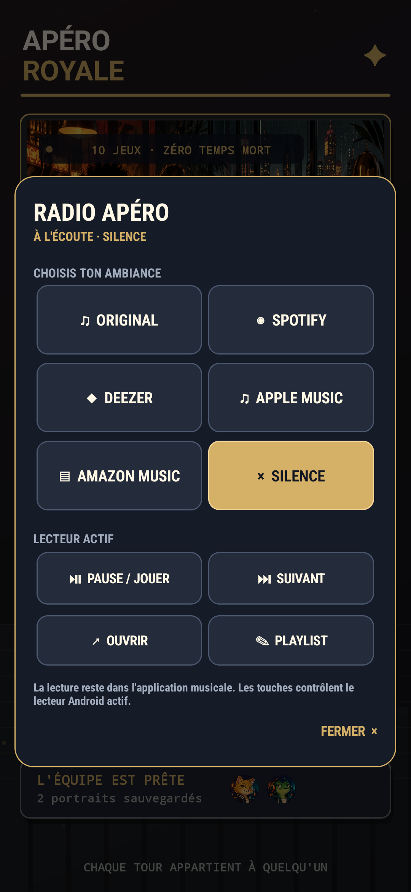

## La boucle de jeu

1. **Créez la salle.** Chaque personne prend un pseudo, une langue FR/EN et un portrait exclusif parmi six sprites, ou importe une photo. La table est retrouvée lors des soirées suivantes ; le salon permet de modifier ou retirer chaque profil.
2. **La salle choisit.** En mode Vote, chacun choisit parmi trois défis. En mode Libre, le groupe ouvre le catalogue ; en mode **Turbo**, le jeu enchaîne des défis surprises plus courts.
3. **Le téléphone passe.** L’écran annonce le numéro de tour, le pseudo et le défi. Le chrono reste arrêté jusqu’à ce que le joueur concerné touche **C’est moi** sur le téléphone partagé. Si cette personne s'est éloignée, la table peut **passer sa participation** sans inventer son vote ou ses points.
4. **Le joueur actif mise.** Il choisit 1, 2 ou 3 gorgées virtuelles. Dans Culture G et Blind Test, les amis répondent avant lui ; dans Réflexe, Roulette, Mémoire et Rythme, chacun prépare un élément du défi. Les autres posent un verdict, devinent le dessin ou se passent la bombe. Ces choix rapportent des points et modifient le défi. Sur un téléphone partagé, **C’est moi** ouvre chaque choix privé et suspend le chrono pendant le passage.
5. **Les rôles changent.** Le dessin est deviné par tous les non-artistes ; la moitié doit trouver pour que l’artiste gagne. Dans la bombe, chaque porteur choisit à qui la passer, puis peut tenter un fil après un tour de la salle. Le joueur actif **alterne à chaque manche** ; chaque ami a une action dans les dix jeux.
6. **On recommence.** Points, gorgées, séries et classements sont sauvegardés sur le téléphone hôte. La partie se reprend après fermeture de l’application.

En local, **☰** suspend les chronos et donne accès à *Annuler ce défi*, *Retour au salon* et *Accueil · reprendre plus tard*. Un défi annulé n'est jamais inscrit au classement. Sur plusieurs téléphones, les invités continuent de suivre l'hôte.

**Confort 1.4.0.** L’accueil, la palette, l’icône et les réglages adoptent une direction nocturne plus adulte. La source musicale se choisit dans une liste claire ; un bouton dans l’en-tête ouvre l’application choisie pendant la partie. La bande originale du jeu se tait lorsqu’une source externe ou le silence est sélectionné. Effets et vibrations restent séparés. Les écrans s’adaptent aussi aux téléphones 16:9 ; les chronos locaux reprennent après un passage dans les réglages ou en arrière-plan.

**Fiabilité 1.4.1.** [500 soirées simulées](docs/SIMULATION_500_PARTIES.md) ont traversé les dix jeux et les trois modes, avec 7 990 manches et 40 190 restaurations d’état. Deux anomalies ont été corrigées : le choix de règle secrète en Turbo et le verdict du jury à l’expiration du chrono dans le moteur.

**Rythme 1.4.2.** [Un second audit de 500 soirées](docs/SIMULATION_EXPERIENCE_500.md) mesure le temps **modélisé**, les répétitions et les actions propres à chaque mini-jeu. Les contenus écrits et sonores sortent maintenant d'un paquet sans répétition avant épuisement ; roulette et dessin ont des délais finis. L'audit révèle aussi un vrai chantier : à six sur un seul téléphone, le mode Vote prendrait environ 87 s par manche selon les hypothèses publiées, et six jeux laissent leurs amis spectateurs du défi. Ce sont des risques de conception à tester avec de vrais groupes, pas du plaisir validé automatiquement.

**Relais 1.4.3.** Les modes Vote et Turbo rappellent un défi collectif après au plus deux manches sans action de toute la salle. La bombe propose un choix de porteur, des séquences de une à trois touches et un fil rouge/bleu risqué après le passage de chacun. Réflexe, Mémoire et Rythme ont chacun six variantes mécaniques ; le Blind Test joue ses six motifs originaux dans quatre tonalités. [La simulation actualisée](docs/SIMULATION_EXPERIENCE_500.md) estime encore **81 s** par manche à six sur un téléphone en Vote : la cadence et les six défis solo restent à améliorer avec des joueurs réels.

**Toute la salle 1.4.4.** Les six anciens défis solo deviennent collectifs ; le dessin invite désormais tous les amis à deviner. Une interaction propre à chaque jeu remplace le pronostic répétitif. L’écran garde les choix privés jusqu’au démarrage et diffuse ensuite le même état depuis l’hôte. [Le nouvel audit de 500 soirées](docs/SIMULATION_EXPERIENCE_500.md) compte **0 manche solo** parmi 7 990 manches modélisées ; à six sur un téléphone, Vote reste lent (77,3 s modélisées), tandis que Turbo est plus direct. Ce chiffre ne mesure ni les rires ni la latence réelle.

**La ruelle secrète 1.4.5.** Sur plusieurs téléphones, les invités qui attendent après leur action peuvent remarquer deux yeux dans le décor. Les tapoter ouvre un micro-jeu caché : poursuite de chat, code de pattes ou miroir. La découverte se poursuit entre la manche, le résultat et la sélection suivante ; elle reste privée jusqu’au trophée. Le premier à réussir un secret peut choisir une nouvelle règle qui s’applique à toute la salle **au prochain tour**. Ces jeux n’apparaissent ni dans le catalogue ni dans les guides. L’interface des invités suit mieux leur propre langue FR/EN ; les noms longs du catalogue sont plus lisibles. [La simulation de 10 000 soirées](docs/SIMULATION_10000_MULTI.md) teste 40 000 manches et 160 000 vues privées FR/EN, sans prétendre mesurer le plaisir humain ou la latence réelle.

**Laboratoire d’expérience 1.4.7.** [3 000 soirées synthétiques et 36 000 manches](docs/LABO_EXPERIENCE_2026.md) explorent des groupes rapides, hésitants ou interrompus, sur un ou plusieurs téléphones. Le modèle révèle un risque de cadence du Vote partagé à quatre à six et distingue gestes, attente et préparation ; ses durées sont des hypothèses, pas des observations de plaisir. Le salon suggère Turbo pour accélérer une soirée à quatre ou plus sur un téléphone. Un vote non envoyé devient désormais une abstention après son délai, afin que la salle puisse continuer. Le passage local du téléphone suspend ce décompte. Le nouvel écran affiche les secondes restantes.

**Horloge de soirée 1.4.8.** [Trois exécutions de 100 000 soirées, soit 5,4 millions de manches](docs/LABO_EXTREME_2026.md), branchent une horloge virtuelle sur les vrais délais du moteur. Elles croisent 2–6 amis, un, deux ou plusieurs téléphones, interruptions corrélées et réponses absentes. Le groupe peut désormais [passer la participation d'un ami absent](docs/screenshots/handoff-skip.png). Le délai de contribution repart après chaque ami ; Positions, Dessin et Bluff laissent plus de temps à la création. Les durées simulées sont des scénarios de risque, **pas des mesures d'amusement ou de réseau réel**.

L’eau, les boissons sans alcool et les défis sans consommation ont toute leur place. Les gorgées affichées sont des **compteurs de jeu** ; chacun décide librement de ce qu’il boit.

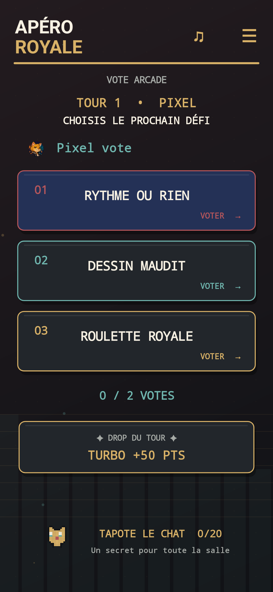

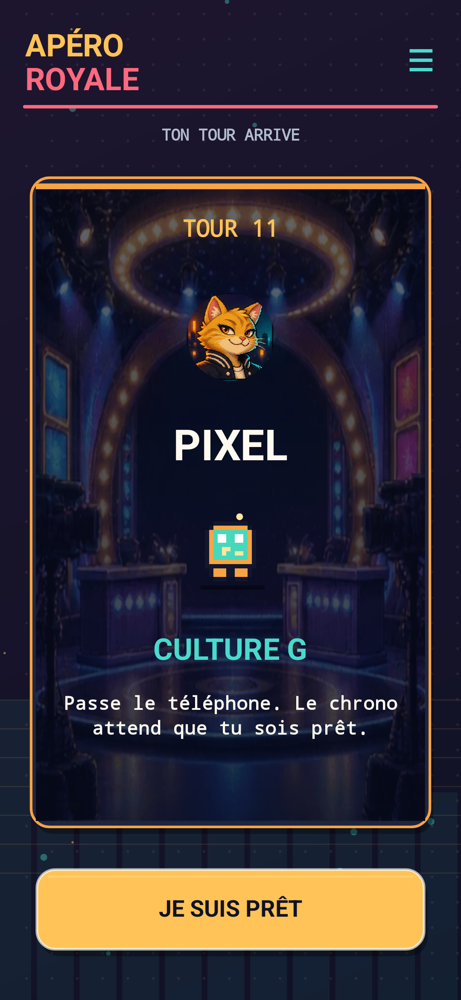

## Dix mini-jeux, dix scènes et sprites dédiés

Chaque jeu possède désormais un **décor nocturne dédié**, un sprite pixel animé et un guide intégré FR/EN. Les commandes restent lisibles sur ces scènes. Le menu **Découvrir les 10 défis** explique les règles avant la partie.

| # | Mini-jeu | Moment de soirée |
| --- | --- | --- |
| 01 | **Culture G** | Les amis répondent en secret ; l’acteur peut suivre la tendance ou oser sa propre réponse. |
| 02 | **Positions à la con** | Une pose absurde à défendre devant le jury des amis. |
| 03 | **Blind Test** | Tous écoutent un motif original, votent puis l’acteur tranche. |
| 04 | **Réflexe néon** | Chacun place une cible ; l’acteur court le parcours façonné par les amis. |
| 05 | **Roulette Royale** | Les amis protègent des gobelets ; pièges secrets, mise et soutien orientent le risque. |
| 06 | **Dessin maudit** | Un artiste dessine, tous les autres devinent en privé ; une majorité fait gagner. |
| 07 | **Mémoire flash** | Les amis construisent la chaîne ; l’acteur la rejoue dans l’ordre. |
| 08 | **Rythme ou rien** | Chacun place un temps ; l’acteur joue la mesure du groupe sur l’horloge de l’hôte. |
| 09 | **Bluff royal** | Raconter une anecdote vraie ou inventée ; le jury devine, le conteur marque s’il trompe la majorité. |
| 10 | **Bombe à bulles** | Une à trois touches par porteur, choix du suivant, puis fil risqué ou relais prudent. |

<table>
<tr><td>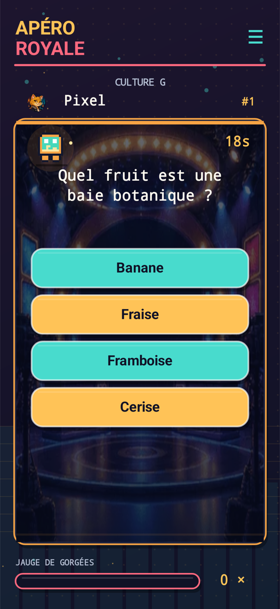</td><td>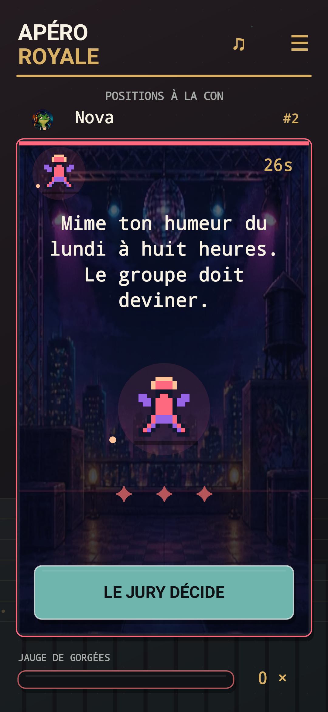</td><td>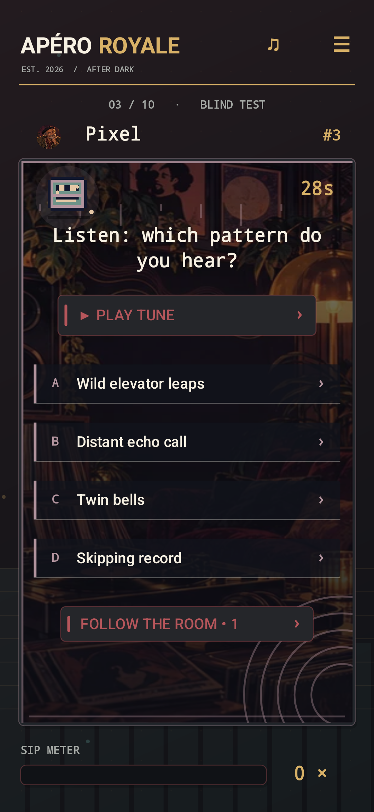</td><td>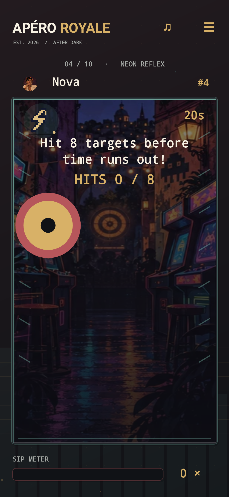</td><td>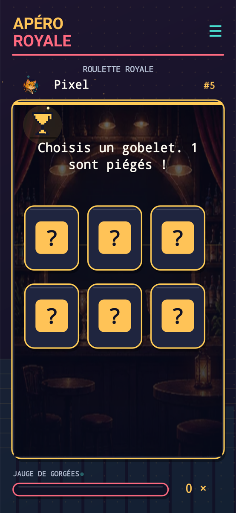</td></tr>
<tr><td>Culture G</td><td>Positions</td><td>Blind Test</td><td>Réflexe</td><td>Roulette</td></tr>
<tr><td>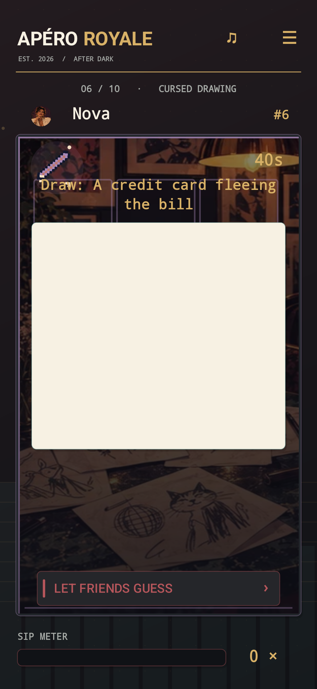</td><td>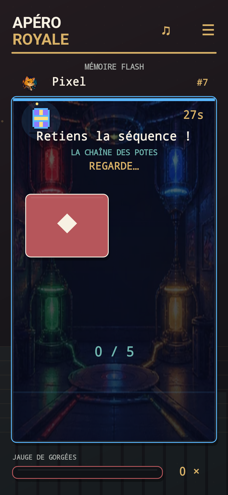</td><td>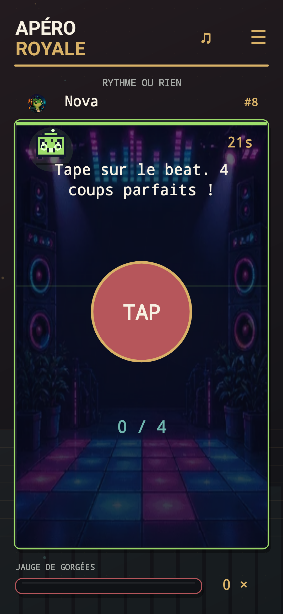</td><td>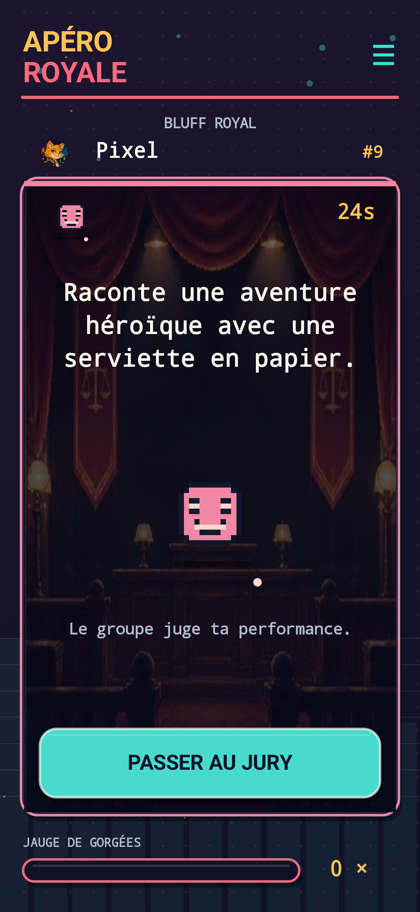</td><td>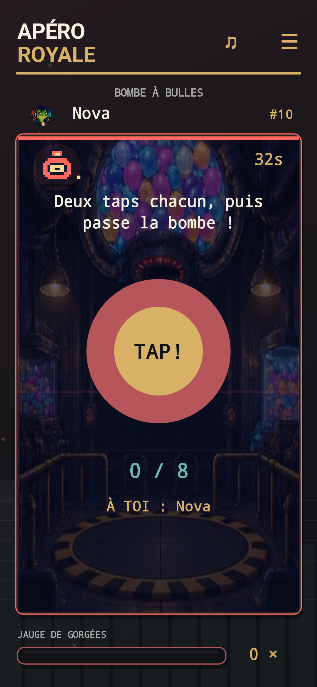</td></tr>
<tr><td>Dessin</td><td>Mémoire</td><td>Rythme</td><td>Bluff</td><td>Bombe</td></tr>
</table>

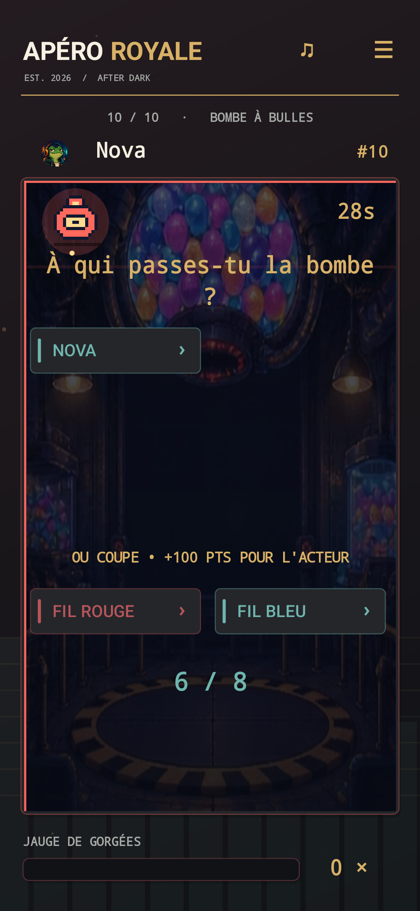

**Avant chaque défi, les potes façonnent la manche :**

<table>
<tr><td>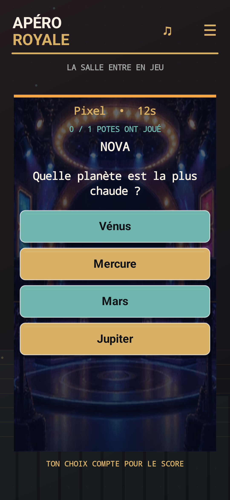</td><td>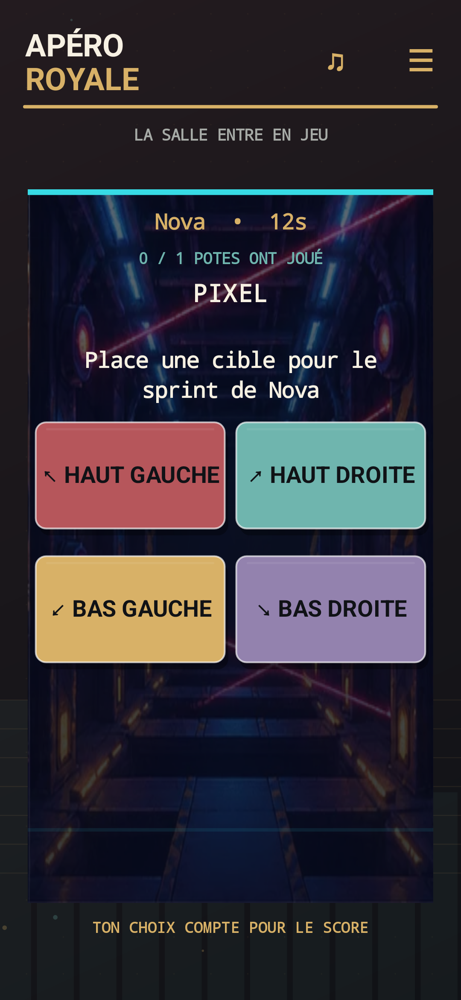</td><td>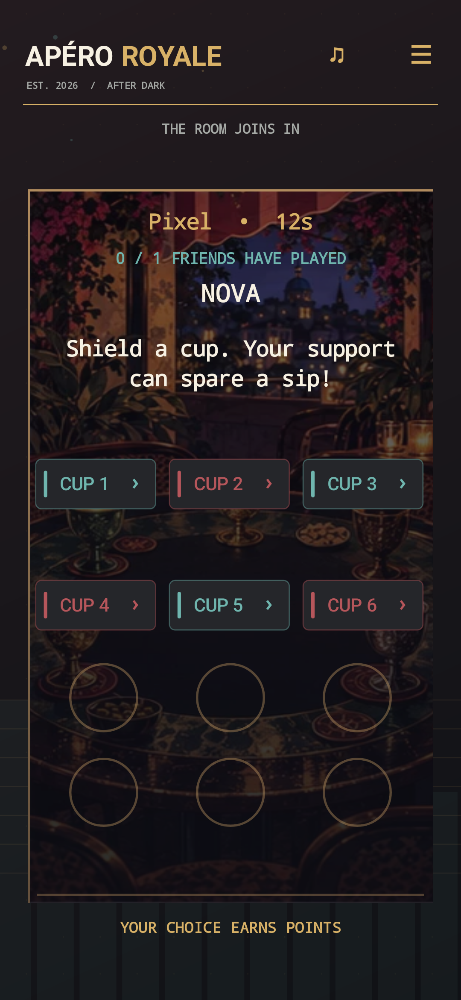</td><td>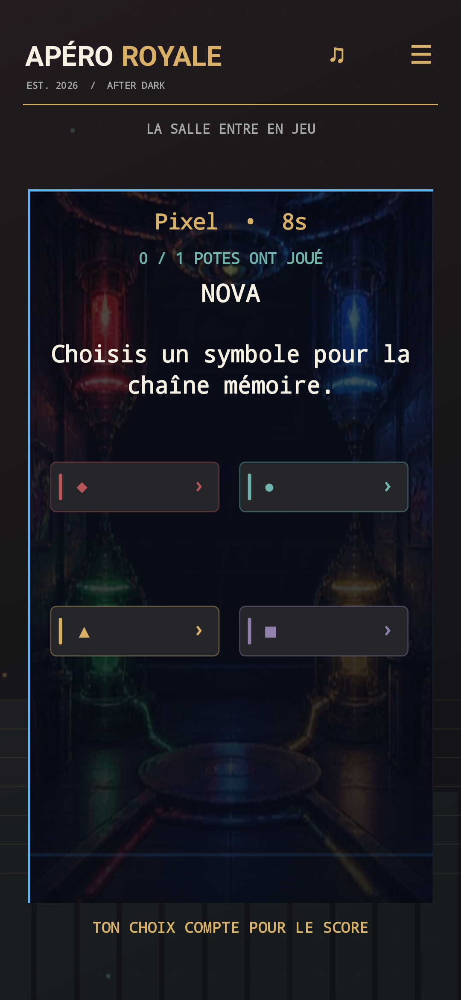</td></tr>
<tr><td>Répondre</td><td>Piéger</td><td>Protéger</td><td>Composer</td></tr>
</table>

## Les secrets de la salle 🐈

Les écrans d’attente à plusieurs appareils cachent désormais de petites rencontres jouables. Aucun jeu secret n’est listé dans le menu. La progression de chacun est conservée dans la partie et masquée aux autres téléphones ; le trophée découvert, lui, rejoint la salle. Une première découverte peut ouvrir le choix d’une **règle valable pour toute la salle**, synchronisée au prochain tour : mot « oui » interdit, pseudos tabous, questions seulement, toast obligatoire, interdiction de pointer du doigt, et d’autres surprises. Dix autres exploits cachés existent dans les mini-jeux. Si quelqu’un enfreint une règle sociale, un joueur le signale et **la salle vote** avant d’appliquer une gorgée virtuelle. Le jeu n’active pas le microphone pour surveiller les conversations.

<details><summary>Aperçu visuel d’un secret (spoiler)</summary>

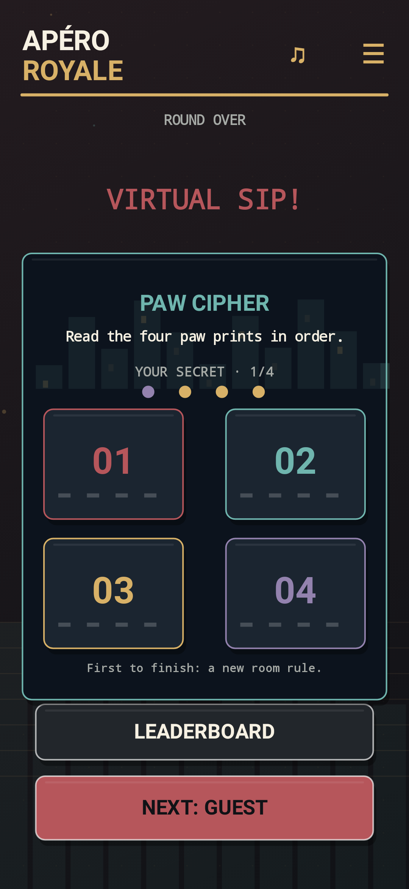

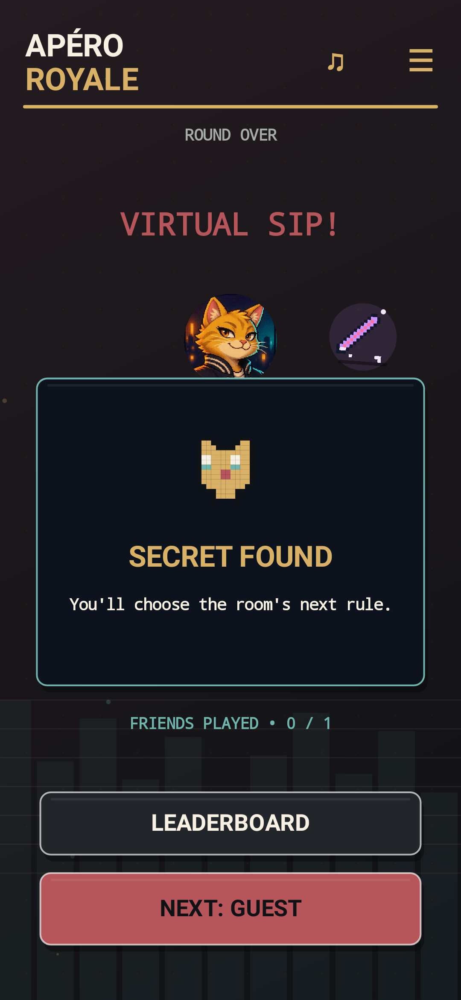

</details>

## Un téléphone ou plusieurs

| Connexion | Mise en place | Usage |
| --- | --- | --- |
| **Un téléphone** | Ajoutez 2 à 6 joueurs dans le lobby. | Chacun prend son tour ; votes, paris, jurys et défis en relais passent d’une main à l’autre. |
| **Wi-Fi** | L’hôte ouvre une salle Wi-Fi ; les amis entrent son IP et le PIN à six chiffres. | Actions et votes synchronisés sur le réseau local, port TCP 43867. |
| **Bluetooth** | Associez les appareils dans Android, puis hébergez/rejoignez avec le PIN. | Salle de proximité via RFCOMM sur appareils compatibles. |
| **Internet** | L’hôte partage le code de salle à 12 caractères. | Synchronisation via relais MQTT TLS avec messages chiffrés en AES-GCM. |

L’hôte garde la partie ouverte et arbitre les actions. Les invités peuvent voter, préparer chaque défi, jouer leur tour et participer aux jurys ou aux devinettes depuis leur appareil. Les réponses, pièges et votes avant révélation sont retirés des instantanés envoyés à chaque rôle. Les portraits restent uniques dans la salle ; les photos facultatives sont réduites localement avant partage. L’interface suit le français ou l’anglais du joueur concerné. Le classement historique est enregistré sur l’hôte ; les profils de même pseudo créés lors de soirées différentes partagent encore leurs statistiques historiques.

Le relais Internet par défaut, [`ssl://broker.emqx.io:8883`](https://www.emqx.com/en/mqtt/public-mqtt5-broker), est un **service public de test**. Son accès et sa disponibilité ne sont pas garantis ; le menu accepte un autre relais MQTT TLS compatible. Le code de salle est partagé entre invités : il ne protège pas les messages d’un participant malveillant qui connaît ce code. Le Wi-Fi local ne chiffre pas ses messages : utilisez un réseau de confiance. Le Bluetooth dépend de l’appairage et du support Android.

## Une ambiance que vous contrôlez

La bande originale démarre discrètement à **18 %** pour une nouvelle installation, avec quatre variations de phrase, un timbre par jeu, une basse douce et un signal court lors du passage de tour. Dans une salle à plusieurs téléphones, l’ambiance continue sur l’hôte ; les invités gardent leurs effets et motifs de jeu, ce qui évite plusieurs boucles musicales décalées. Le menu **Musique** permet de choisir bande originale, Spotify, Deezer, Apple Music, Amazon Music ou silence. Pour les services externes, collez facultativement une URL HTTPS de playlist puis touchez **Ouvrir l’application**. Le raccourci ♫ dans l’en-tête permet de rouvrir le service pendant la partie. La lecture et ses commandes restent dans l’application musicale choisie ; aucun compte ou abonnement n’est fourni par le jeu. Le menu distingue aussi style *Chill / Arcade*, volume de la bande originale, effets et vibrations. Les réglages sont mémorisés localement.

La version 1.4.0 retire l’ancien contrôle OAuth et le quiz fondé sur la Web API Spotify : la [Developer Policy Spotify](https://developer.spotify.com/policy) interdit les jeux et quiz construits avec sa plateforme sans autorisation applicable. Les quatre services musicaux sont des **raccourcis d’écoute indépendants** : Apéro Royale n’inspecte pas leurs titres et ne pilote pas leur lecture. Le défi sonore reste jouable hors ligne avec six motifs originaux. La [spécification de refonte des dix jeux](docs/REFONTE_DIX_MINI_JEUX.md) distingue ce qui est livré des idées pour les prochaines versions.

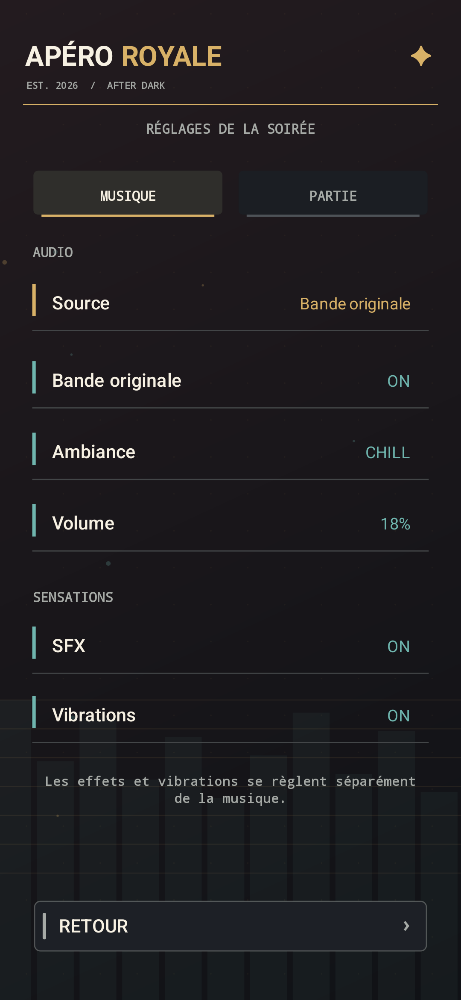

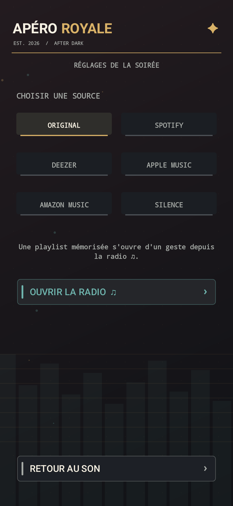

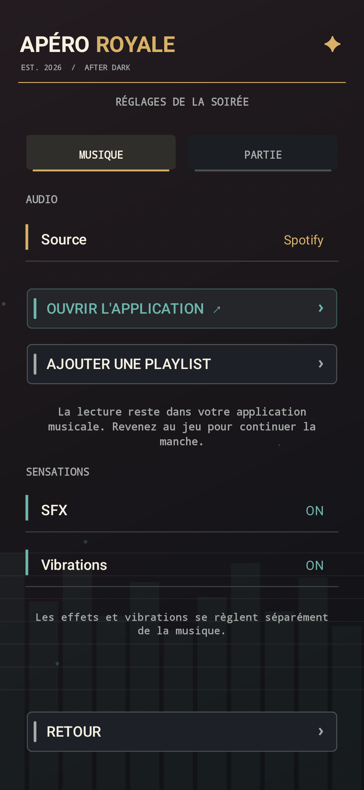

## Pour développer

Android natif Java, JDK 17, Android SDK 36 et Gradle 8.14.3. Aucun serveur n’est requis pour le jeu local.

```sh
./gradlew test assembleDebug
./gradlew testDebugUnitTest --tests com.aperoroyale.PartyExperienceSimulationTest
./gradlew testDebugUnitTest --tests com.aperoroyale.ExperienceRiskLabTest
ADB_SERIAL=emulator-5554 python3 tools/smoke_v120.py
ADB_SERIAL=emulator-5554 python3 tools/smoke_turns.py
ADB_SERIAL=emulator-5554 python3 tools/smoke_turbo.py
ADB_SERIAL=emulator-5554 python3 tools/smoke_pacing.py
ADB_SERIAL=emulator-5554 python3 tools/smoke_vote_timeout.py
```

Pour créer une mise à jour signée, utilisez votre propre clé PKCS12 et placez ses paramètres dans `signing.properties` à la racine ; ce fichier reste hors Git :

```properties
storeFile=/absolute/path/release.p12
storePassword=your-password
keyAlias=apero
keyPassword=your-password
```

`./gradlew assembleRelease` produit `app/build/outputs/apk/release/app-release.apk`. Conservez la même clé pour permettre les mises à jour Android.

`GameEngine` arbitre les tours, choix collectifs, règles et scores. `GameStore` conserve session, historique, statistiques par joueur et par jeu dans SQLite. `ArcadeView` et `GameSprites` dessinent les écrans et scènes. `PartyNetwork`, `BluetoothPartyNetwork` et `InternetPartyNetwork` transportent les commandes et instantanés. `ArcadeAudio` produit musique et effets ; `MusicLinks` valide les liens des services musicaux externes.

Illustrations originales dans [`art/source`](art/source), décors des mini-jeux sous [`app/src/main/res/drawable-nodpi`](app/src/main/res/drawable-nodpi) et captures réelles d’émulateur sous [`docs/screenshots`](docs/screenshots). Licence [MIT](LICENSE). Pas de compte Apéro Royale, de publicité ni de télémétrie. [Notes sur les données](PRIVACY.md) et [licences tierces](THIRD_PARTY_NOTICES.md).

**Pour guider la prochaine version :** [laboratoire extrême à horloge virtuelle](docs/LABO_EXTREME_2026.md), [premier laboratoire d'expérience](docs/LABO_EXPERIENCE_2026.md), [diagnostic des dix mini-jeux](docs/REFONTE_DIX_MINI_JEUX.md) et [audit produit initial](docs/AUDIT_PRODUIT_2026.md). Ces documents distinguent les mécaniques déjà livrées des hypothèses à tester avec de vrais groupes.

---

**English:** Apéro Royale 1.4.8 is a French/English Android party arcade for 2–6 friends on one or several phones over Wi-Fi, paired Bluetooth or an Internet room code. Local profiles and the leaderboard survive new parties. A shared phone can skip an absent friend's private turn without inventing a vote. Group contribution time renews after each player, and the social drawing, pose and bluff challenges allow more creation time. A virtual-clock lab ran 300,000 synthetic parties across three seeds and publishes its assumptions; it does not claim to measure human enjoyment or real network latency. The signed APK is linked above.
