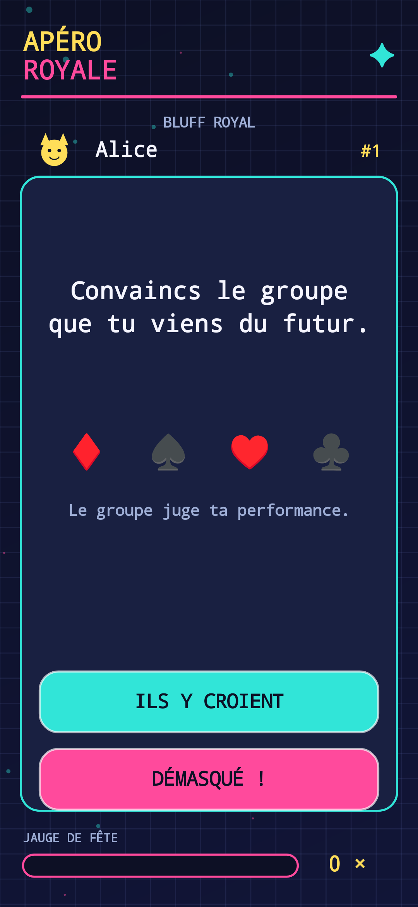

# Apéro Royale


A local-first retro arcade party game for Android 8+ (API 26). Two to six players can pass one phone around, or join a host on the same Wi-Fi network. Each player's language is FR or EN and the game changes language on that player's turn.

## Play

Start a party, add at least two players, choose their original illustrated avatars and languages, then start the wheel. Losing a mini-game adds a **virtual** drink to the party meter. Alcohol is optional; water works just as well. The app tracks points, wins and virtual drinks, persists the current party in SQLite, and keeps a lifetime leaderboard.



The ten games are Odd Trivia, Silly Poses, Blind Test, Neon Reflex, Royal Roulette, Cursed Drawing, Flash Memory, Beat or Bust, Royal Bluff and Bubble Bomb. The offline Blind Test uses six original synthesized melodies. Menus have original chiptunes, with audio and haptic feedback.

### Same Wi-Fi play

On the host phone, create a party and tap **Host Wi-Fi**. Other players tap **Join Room** on their phones and enter the displayed local IP and six-digit room PIN, their nickname and language. The host controls the turn order and saves the game. Each remote phone can act when its own player is active. All devices need to be on the same local network; port 43867 must be reachable. This is a private LAN room with no relay or cloud account. Room traffic is not encrypted; use a trusted Wi-Fi network.

### Spotify

Spotify is optional. In Music / Spotify, enter a Spotify application **Client ID** and playlist URL or ID, then connect. Register `http://127.0.0.1:43868/callback` as the app's redirect URI in the Spotify Developer Dashboard. The app uses OAuth PKCE, reads tracks from the chosen playlist and requests playback on the user's active Spotify device for Blind Test or Radio Apéro. Spotify Premium and an active device are required for Web API playback. In development mode, Spotify may restrict users and playlist access. The app remains fully playable without Spotify. It never downloads Spotify previews or embeds a client secret.

Spotify's access and refresh tokens remain in process memory and are not stored. A new app launch may require reconnecting. The Client ID and playlist ID are stored locally.

## Build

Requires JDK 17, Android SDK 36 and Gradle 8.14.3. A Gradle wrapper is included.

```sh
./gradlew assembleDebug
```

For an installable release APK, create a private PKCS12 signing key, then add a local, untracked `signing.properties`:

```properties
storeFile=/absolute/path/release.p12
storePassword=your-password
keyAlias=apero
keyPassword=your-password
```

Run `./gradlew assembleRelease`. The signed APK is `app/build/outputs/apk/release/app-release.apk`. Keep the key safe: Android updates require the same signing identity. No key or password is committed.

## Architecture

`GameEngine` owns the turn state and shuffled game deck. `GameStore` persists the active session and historical stats in SQLite. `ArcadeView` paints a scalable, contrast-heavy vector UI and handles game input. `PartyNetwork` synchronizes snapshots over TCP on the local network. `SpotifyBridge` implements the optional OAuth PKCE / Web API integration. `ArcadeAudio` generates original PCM chiptunes and sound effects on the device.

## License

MIT. See [LICENSE](LICENSE). Privacy details: [PRIVACY.md](PRIVACY.md).
