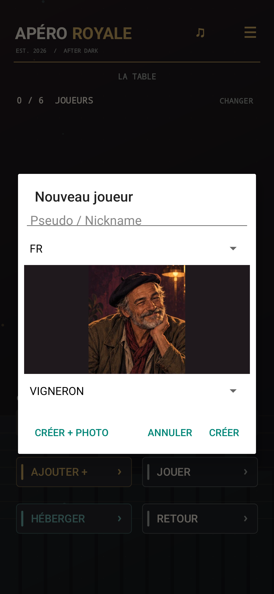
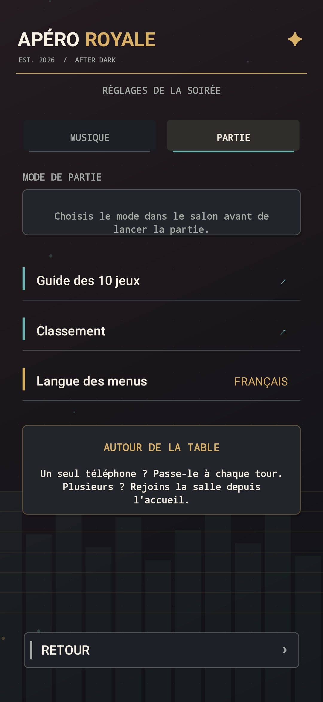
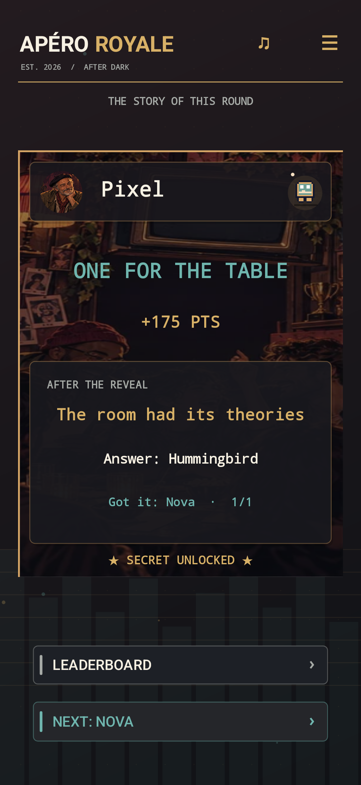
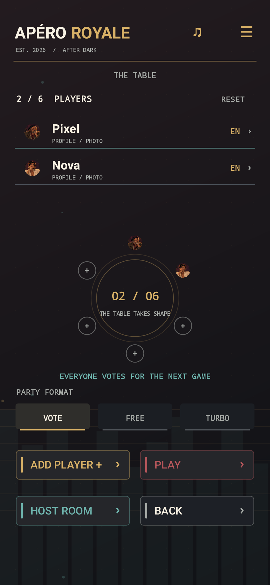
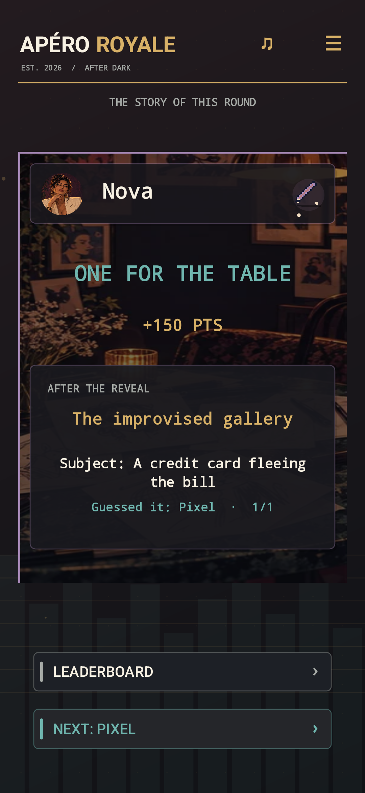
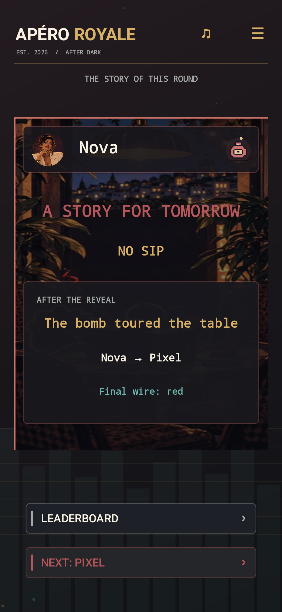
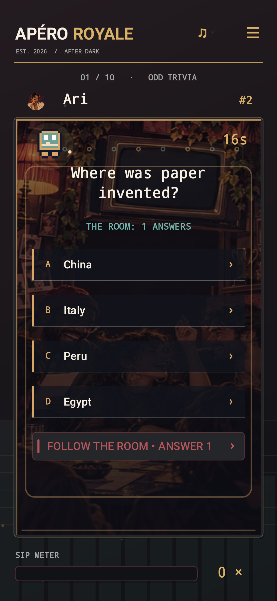
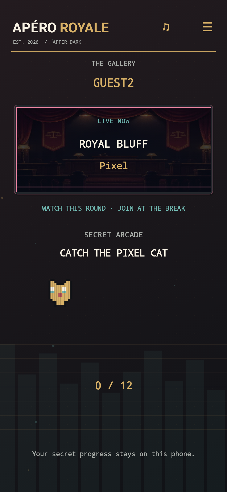
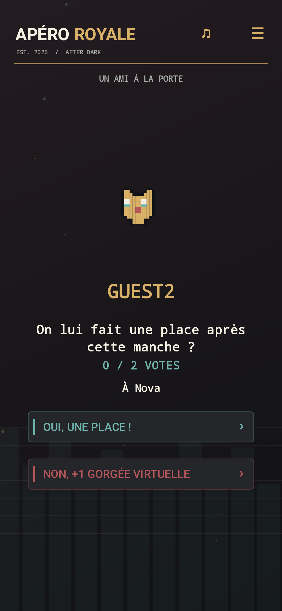
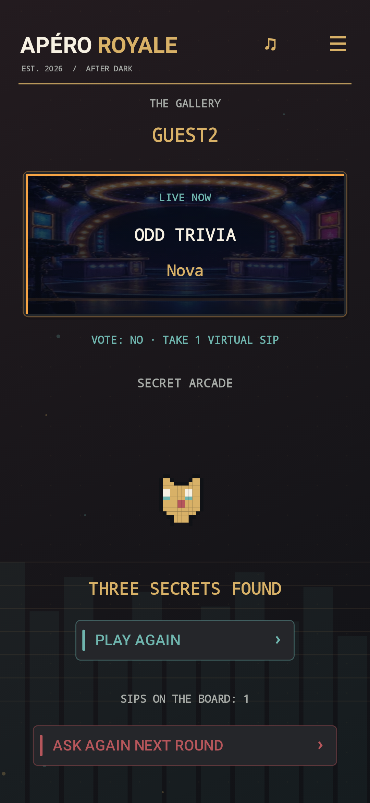

# APÉRO ROYALE

### La nuit est à vous.

**Dix défis, 2 à 6 amis, une table qui a des histoires à raconter.** Apéro Royale est un jeu de soirée Android en français et en anglais. Un téléphone suffit : on le passe à chaque action privée. Avec plusieurs téléphones, chacun vote, piège, dessine, devine ou juge depuis le sien.

[**Télécharger l’APK Android signé · 1.6.0**](https://raw.githubusercontent.com/nabz0r/AperoRoyal/main/releases/AperoRoyale-v1.6.0.apk) · Android 8.0+ · [Notes de version](RELEASE.md) · [Confidentialité](PRIVACY.md)

**Un bar de nuit, pas une cour de récré.** Personnages adultes, affiches de bistrot et d’arcade, cuivre et aubergine, dix scènes illustrées. Le résultat révèle les alliés, les sceptiques et les auteurs du chaos. Les petits jeux secrets restent cachés dans les temps d’attente.

<table>
<tr><td></td><td></td><td></td></tr>
<tr><td>12 portraits ou votre photo</td><td>Menus FR/EN, joueurs bilingues</td><td>La manche devient une anecdote</td></tr>
</table>

## Une soirée en trois gestes

1. **Posez les noms sur la table.** Ajoutez 2 à 6 profils avec pseudo, langue, l’un des 12 portraits adultes ou une photo. Plusieurs amis peuvent choisir le même portrait. Les profils reviennent à la prochaine soirée.
2. **Choisissez le rythme.** **Vote** : chacun choisit le prochain jeu. **Libre** : la table ouvre le catalogue. **Turbo** : le jeu tire des manches surprises plus courtes.
3. **Passez le téléphone ou jouez chacun sur le vôtre.** Avant le défi, chacun a une action. Le joueur actif mise 1 à 3 gorgées virtuelles, relève le défi, puis le rôle change au tour suivant.

La règle de base est simple : **tu perds le défi, tu prends les gorgées virtuelles que tu as misées**. Les points et le classement ajoutent du piquant. Pose et Bluff offrent un passage sans pénalité ; la table peut toujours remplacer une gorgée par de l’eau, du sans alcool, un défi ou rien.

<table>
<tr><td></td><td></td><td></td></tr>
<tr><td>La table</td><td>Le choix collectif</td><td>À toi de jouer</td></tr>
</table>

## Dix défis, dix ambiances

Chaque défi a sa scène illustrée, son geste d’arcade et un guide FR/EN dans l’app. L’entrée annonce l’enjeu ; le dévoilement raconte qui a participé. Les commandes restent faciles à toucher quand la soirée bat son plein.

| Défi | Ce qui se passe autour de la table |
| --- | --- |
| **Culture G** | Tout le monde répond en secret ; l’acteur tente sa réponse ou suit la tendance. |
| **Positions à la con** | Une scène de bistrot à jouer seul, assis ou avec un complice volontaire ; le jury tranche. |
| **Blind Test** | Un jingle fictif original à reconnaître ; chacun écoute et vote. |
| **Réflexe néon** | Les amis placent les cibles que l’acteur devra toucher. |
| **Roulette Royale** | Chacun protège un verre ; l’acteur choisit son risque. |
| **Dessin maudit** | Un dessin, puis les devinettes privées des autres. |
| **Mémoire flash** | Les amis composent la chaîne que l’acteur devra rejouer. |
| **Rythme ou rien** | La salle construit la mesure ; l’acteur tape les temps justes. |
| **Bluff royal** | Alibi vrai ou inventé ? Le jury tranche, les crédules sont révélés. |
| **Le dernier fil** | Un objet passe de main en main avant le choix final. |

<table>
<tr><td></td><td></td><td></td><td></td><td></td></tr>
<tr><td>Culture G</td><td>Positions</td><td>Blind Test</td><td>Réflexe</td><td>Roulette</td></tr>
<tr><td></td><td></td><td></td><td></td><td></td></tr>
<tr><td>Dessin</td><td>Mémoire</td><td>Rythme</td><td>Bluff</td><td>Bombe</td></tr>
</table>

<table>
<tr><td></td><td></td><td></td></tr>
<tr><td>Les bonnes intuitions</td><td>La galerie improvisée</td><td>Les mains de la table</td></tr>
</table>

## Un téléphone ou plusieurs

| Vous êtes… | Mise en place |
| --- | --- |
| **Autour d’un seul téléphone** | Créez les profils, puis passez l’appareil quand « C’est moi » apparaît. Les choix privés restent cachés jusqu’à la révélation. |
| **Sur le même Wi-Fi** | L’hôte ouvre une salle Wi-Fi. Les amis rejoignent avec son adresse et le PIN à six chiffres. |
| **À proximité en Bluetooth** | Appairez les téléphones Android, puis hébergez ou rejoignez la salle avec le PIN. |
| **Connectés par Internet** | L’hôte partage un code de salle à douze caractères. Le relais MQTT TLS par défaut est un service public de test ; sa disponibilité n’est pas garantie. |

L’hôte conserve la partie et le classement. Les invités votent et agissent depuis leur écran ; chaque tour utilise la langue du joueur actif, tandis que la langue des menus se règle dès l’accueil ou dans **Options → Partie**. Une partie peut être reprise après fermeture. Le menu de pause permet de revenir au salon, de reprendre, ou d’annuler le défi courant sans points ni gorgée. Un ami absent peut passer son action privée pour que la soirée continue.

### Un ami débarque en pleine partie

Il rejoint la salle avec le même code et son pseudo, même si une manche a commencé. Son téléphone montre le défi en cours et lui ouvre une petite **arcade secrète** : chat pixel à attraper, code de pattes, puis miroir. À la fin de la manche, chaque joueur déjà présent vote **oui** ou **non** pour lui faire une place au tour suivant. La majorité des votes exprimés l’accueille ; une égalité ou aucun vote le refuse. Les votes individuels restent cachés, et le scrutin avance après douze secondes sans réponse.

En cas de refus, le nouvel arrivant prend **une gorgée virtuelle inscrite au classement** et peut demander un nouveau vote au tour suivant. Ses secrets restent jouables pendant l’attente. Une seule demande d’entrée peut attendre à la fois et la table garde sa limite de six joueurs. Pour une soirée sans alcool, la gorgée peut naturellement être remplacée par un défi ou une boisson sans alcool.

<table>
<tr><td></td><td></td><td></td></tr>
<tr><td>Regarder et jouer</td><td>Décider ensemble</td><td>Retenter sa chance</td></tr>
</table>

## Une radio qui vous laisse choisir

Bande originale plus espacée, style Chill ou Arcade, volume, effets et vibrations se règlent séparément. Les jingles et les verdicts prennent la place de la musique pendant les moments clés. Vous pouvez aussi choisir **Spotify, Deezer, Apple Music ou Amazon Music**, mémoriser un lien de playlist et ouvrir votre application musicale depuis la radio ♫. Le jeu ne pilote pas ces services et n’utilise pas leurs catalogues pour le Blind Test : celui-ci joue des motifs originaux, même hors ligne.

<table>
<tr><td></td><td></td><td></td></tr>
</table>

## Des secrets à découvrir

Sur plusieurs appareils, les écrans d’attente cachent de petits jeux. Une découverte faite par un joueur déjà dans la partie peut donner le droit de proposer une règle valable pour toute la salle au tour suivant. L’arcade de l’invité en attente reste sur son téléphone et n’influence pas le vote d’entrée. Si une règle sociale est contestée, la salle vote. Aucun microphone ne surveille les conversations.

Voir un secret en image

## Confiance et fabrication

Apéro Royale fonctionne sans compte, publicité ni télémétrie. Les profils, parties et classements sont stockés localement sur le téléphone hôte. Les photos facultatives sont réduites avant partage. [Données et réseau](PRIVACY.md) · [Licence MIT](LICENSE) · [Licences tierces](THIRD_PARTY_NOTICES.md).

Projet Android natif Java, JDK 17, SDK 36, Gradle 8.14.3. Les sources principales sont dans app/src/main/java/com/aperoroyale. GameEngine gère les tours, GameStore conserve la partie dans SQLite, ArcadeView et GameSprites dessinent les scènes, ArcadeAudio joue la musique et les effets. La clé de signature n’est pas dans le dépôt.

~~~sh
./gradlew testDebugUnitTest assembleDebug
ADB_SERIAL=emulator-5554 python3 tools/smoke_v120.py
~~~

[Direction artistique, dix scènes et stress test 1.6.0](docs/RELEASE_160_DESIGN.md) · [Stress test social des succès Android](docs/STRESS_TEST_SOCIAL_2026.md) · [Analyse des dix jeux](docs/REFONTE_DIX_MINI_JEUX.md) · [Modèle de joueurs virtuels](docs/LABO_GENS_VIRTUELS_2026.md) · [Historique des versions](RELEASE.md). Les simulations vérifient des règles et des délais supposés ; elles ne prouvent pas l’amusement ou la latence sur de vrais téléphones.

---

**English:** Apéro Royale 1.6.0 is a French/English Android party arcade for 2–6 friends, on one phone or several. Menus have their own FR/EN choice and turns follow each player’s language. Twelve adult portraits, optional photos, ten illustrated challenges and social round reveals give the table something to talk about. A late friend can spectate, play hidden games, and face an admission vote at the next break. Profiles and the leaderboard persist. The signed APK is linked at the top; streaming services open in their own apps, while the music quiz uses original offline motifs.
