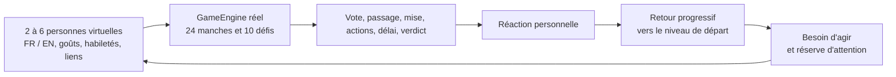

# Le laboratoire organique

### 30 000 soirées virtuelles · 720 000 manches · zéro faux capteur

**Suite 1.7.0 :** les mêmes trois graines ont été rejouées après les changements de rythme. [Lire la comparaison avant/après, les dix jeux et les nouveaux CSV](RELEASE_170_RYTHME.md).

L'idée est simple : une soirée n'est pas une suite de clics indépendants. Le même pari peut réveiller une personne, épuiser une autre et laisser une troisième attendre son tour. Ce laboratoire fait jouer des agents persistants au **vrai `GameEngine`**, puis relit chaque partie comme une trajectoire individuelle. Il emprunte à *The Sims* l'idée de besoins et de mémoire d'une soirée, et à la recherche physiologique la distinction **état de départ → réaction → récupération**.

> **Ce test ne mesure aucune biométrie.** « Activation », « réserve » et « silence » sont des variables synthétiques sans unité médicale. Elles ne sont ni fréquence cardiaque, ni variabilité cardiaque, ni alcoolémie, ni diagnostic, ni score de plaisir. Le jeu ne collecte aucun signal corporel.

## Ce qui tourne vraiment



Les personnes virtuelles gardent déjà leurs préférences, leur ennui par jeu, leur confiance, leur énergie, leur humeur et leurs affinités ; ces états influencent leurs votes, leurs mises, leurs réponses et leurs actions futures. Le nouveau modèle observe en plus chaque manche terminée : joueur actif, jeu, mise, résultat, gorgées virtuelles, durée, délai dépassé, vote et participation de chaque ami. Il rejoue **la même trace** sous trois hypothèses de récupération (rapide, médiane, lente), ce qui évite de confondre une différence de comportement avec une différence de paramètres du modèle.

Le moteur passe par les trois topologies simulées (un téléphone, deux, un chacun), les trois modes (Vote, Libre, Turbo), les tailles de table de 2 à 6, et les dix jeux. La simulation contient des délais de manipulation et de réseau *supposés* ; elle n'émet pas de paquets Wi-Fi, Bluetooth ou Internet et ne mesure pas la latence d'un appareil.

## Une mesure relative, jamais un verdict sur la personne

Pour chaque personne `i`, chaque manche de durée `Δt` laisse l'activation virtuelle revenir progressivement vers son niveau de départ :

`A_i(t) = A_i(t−1) × exp(−Δt / τ) + réactivité_i × stimulus_i(t)`

Sa réserve revient elle aussi vers **sa propre** réserve initiale, puis diminue selon l'effort hypothétique de la manche. Le stimulus varie avec le rôle actif ou spectateur, la mise, le verdict, le délai, la répétition et la participation. Le temps sans action significative est suivi séparément : une faible activation peut être de l'attente, pas une « bonne » soirée. Les constantes sont des hypothèses de design, **pas des coefficients ajustés sur des humains**.

Chaque rapport compare les huit premières manches aux huit dernières **chez la même personne**. Il publie la distribution des écarts appariés (`p10`, médiane, `p90`), la variation de réserve personnelle, le `p90` du plus long silence, les délais dépassés et l'écart de tours entre joueurs. Les valeurs d'activation sont divisées par la réactivité propre à l'agent. Un test unitaire vérifie cette normalisation ; un autre vérifie que l'état revient vers sa base après une période calme.

Ce choix s'inspire des études longitudinales qui distinguent repos, réactivité et récupération *au sein d'une personne*, avec une forte variabilité entre personnes et des facteurs de contexte à contrôler ([Bamert & Inauen, 2022](https://www.frontiersin.org/journals/psychology/articles/10.3389/fpsyg.2022.943065/full)). Une étude expérimentale de coordination sociale montre aussi que nouveauté et contexte peuvent modifier la synchronie physiologique sans relation simple avec la performance : nous évitons donc d'assimiler activation, synchronie ou victoire au plaisir ([étude de coordination, 2025](https://pmc.ncbi.nlm.nih.gov/articles/PMC11913774/)). Ces travaux motivent **la structure des questions**, pas les chiffres de notre simulation.

## Ce que disent les 30 000 soirées

Trois graines déterministes de 10 000 soirées chacune, 24 manches par soirée ; modèle de récupération **médian** ci-dessous. Les plages sont les résultats minimum–maximum entre les trois graines, pas des intervalles de confiance sur des humains.

| Situation | Médiane de variation personnelle d'activation | Médiane de perte de réserve | Plus long silence `p90` | Manches expirées |
| --- | ---: | ---: | ---: | ---: |
| Un téléphone | +0,0165 à +0,0169 | +0,0516 à +0,0522 | 106–108 s | 15,3–15,6 % |
| Deux téléphones | +0,0393 à +0,0399 | +0,1054 à +0,1063 | 70–71 s | 8,2–8,5 % |
| Un téléphone chacun | +0,0503 à +0,0509 | +0,1246 à +0,1252 | 65–66 s | 8,1–8,3 % |
| Vote | +0,0266 à +0,0277 | +0,0825 à +0,0836 | 60–62 s | 8,7–9,0 % |
| Libre | +0,0314 à +0,0326 | +0,0913 à +0,0920 | 98–100 s | 8,5–8,6 % |
| Turbo | +0,0432 à +0,0437 | +0,1076 à +0,1098 | 93–95 s | 14,5–14,8 % |
| Deux joueurs | +0,0697 à +0,0728 | +0,1564 à +0,1591 | 53–54 s | 9,7–10,2 % |
| Six joueurs | +0,0238 à +0,0249 | +0,0717 à +0,0721 | 98–102 s | 12,1–12,5 % |

**Lecture utile :** sur un téléphone, le passage de main allonge les silences et les délais dépassés. Plusieurs téléphones raccourcissent l'attente dans ce modèle, mais enchaînent aussi les sollicitations plus vite : l'activation et la baisse de réserve synthétiques montent. À deux, chacun est sollicité souvent ; à six, l'attente augmente. Il n'y a pas de « meilleur » mode dans ces chiffres. Le modèle à récupération rapide atténue les écarts ; le modèle lent les amplifie. L'ordre des tensions ci-dessus reste globalement le même dans les trois hypothèses et les trois graines.

**Par jeu :** `Dessin maudit` termine sur délai dans **17,8–18,1 %** des manches simulées, `Blind Test` dans **14,2–14,9 %**. Cela indique des parcours à observer en priorité, pas un taux d'échec humain prédit. Une expiration peut venir d'un ami absent et de l'attente normale du verdict. `Rythme` affiche 0 % dans ces traces car les agents clôturent l'épreuve avant l'échéance ; ce zéro dépend du script des agents, pas d'une garantie de fluidité réelle. Les dix jeux ont été traversés sur chaque campagne et chaque agent a eu au moins un tour. Les règles secrètes d'inversion créent parfois un écart maximal de deux tours sur 24 ; cet écart est maintenant visible au lieu d'être masqué par une assertion erronée.

## Fichiers et reproduction

| Graine | Cohortes | Dix jeux |
| --- | --- | --- |
| `20261005` | [CSV](data/organism-10k-20261005-cohorts.csv) | [CSV](data/organism-10k-20261005-games.csv) |
| `8675309` | [CSV](data/organism-10k-8675309-cohorts.csv) | [CSV](data/organism-10k-8675309-games.csv) |
| `11674260475909` | [CSV](data/organism-10k-11674260475909-cohorts.csv) | [CSV](data/organism-10k-11674260475909-games.csv) |

```sh
APERO_ORGANISM_PARTIES=10000 APERO_PEOPLE_SEED=20261005 \
  ./gradlew :app:testDebugUnitTest \
  --tests com.aperoroyale.OrganismStressSimulationTest --rerun-tasks
python3 tools/export_organism_stress.py \
  --prefix docs/data/organism-10k-20261005
```

Utiliser JDK 17 et un SDK Android local comme pour le reste du projet. Le test quotidien exécute 600 soirées ; `APERO_ORGANISM_PARTIES` peut monter jusqu'à 100 000. Le script d'export refuse une campagne incomplète ou un rapport JUnit en échec.

## Ce que le laboratoire pousse à tester avec de vraies tables

1. **Un téléphone :** filmer avec accord une partie à 4–6 et noter le temps de passage, le nombre de reprises en main, les moments où une personne attend sans comprendre quoi faire. Une action collective simple pendant le passage pourrait réduire le silence, mais il faut vérifier qu'elle ne ralentit pas davantage.
2. **Turbo et deux joueurs :** observer si les manches rapprochées donnent de l'énergie ou saturent la table. Demander « envie d'en refaire une ? » après 8, 16 et 24 manches, puis comparer à la trajectoire simulée sans transformer cette réponse en biométrie.
3. **Dessin et Blind Test :** chronométrer séparément création, réponse des autres et verdict. Un délai fréquent dans le modèle peut être une tension comique ou une cassure ; seule une partie réelle permet de trancher.

Les prochains seuils de produit doivent venir d'observations consenties, de récits et de parties réelles FR/EN, pas d'une optimisation aveugle de ces nombres. Aucune donnée corporelle n'est nécessaire pour prendre ces décisions.
