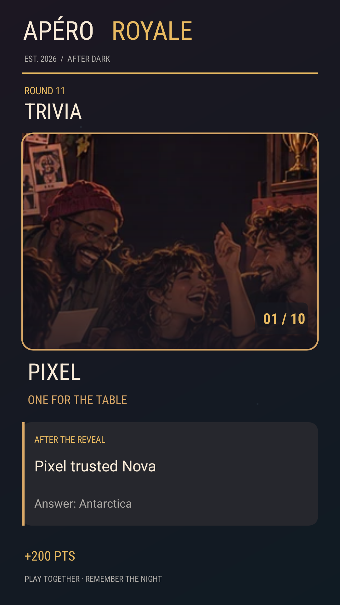

# 1.8.0 — Faire confiance à la table

La manche doit créer une histoire entre amis, pas seulement annoncer un score. Cette version donne un choix social précis à Culture G et Blind Test : répondre soi-même, suivre la tendance de la salle ou miser sa réponse sur un ami nommé. L'ami a déjà répondu, mais sa réponse reste cachée jusqu'au dévoilement. Si le duo a raison, chacun gagne **25 points supplémentaires**. Une mauvaise confiance ne crée pas de gorgée supplémentaire : la mise ordinaire de la manche reste la seule pénalité éventuelle.

Bluff royal désigne maintenant un ami chargé de poser à voix haute une question de relance adaptée à la langue de l'acteur. Le jury continue de voter individuellement. Les dix jeux gardent leurs décors illustrés, leurs actions de groupe et leur aide FR/EN.

## Une image de la soirée, sur demande

Le résultat propose **Partager** à côté du classement. Le jeu dessine une carte PNG de 1080 × 1920 pixels avec le décor du mini-jeu, le pseudo de l'acteur, le verdict, une partie de l'histoire et le score ou les gorgées virtuelles. Le badge de résultat et la carte utilisent le numéro du défi avec l'illustration adulte. La carte n'inclut ni portrait ni photo personnelle. Elle reste dans le cache local tant que personne ne choisit un destinataire dans la feuille de partage Android ; aucun envoi automatique n'existe.

## Cohérence sur plusieurs appareils

L'hôte garde les réponses privées de Culture G et Blind Test pendant la manche. Les instantanés envoyés aux téléphones invités contiennent le nombre de réponses, l'identité du premier ami disponible pour ce choix social et la tendance de la salle, sans les réponses individuelles. Le bouton « suivre un ami » envoie une commande à l'hôte, qui verrouille la vraie réponse de cet ami et distribue les points. Les résultats sont ensuite diffusés normalement. Les contributions des autres mini-jeux restent disponibles là où leur gameplay en a besoin.

## Stress test reproductible

Commande utilisée pour la vérification complète :

~~~sh
APERO_SIM_PARTIES=10000 APERO_PEOPLE_PARTIES=10000 \
APERO_ORGANISM_PARTIES=10000 APERO_SOCIAL_ROUNDS=10000 \
./gradlew :app:testDebugUnitTest :app:assembleRelease :app:lintVitalRelease --offline --rerun-tasks
~~~

| Modèle | Parcours exécuté | Ce qu'il vérifie |
| --- | ---: | --- |
| Horloge et topologies | 10 000 soirées, 180 000 manches | Tours, délais, actions manquantes, reprise, répétition des jeux. |
| Joueurs virtuels | 10 000 soirées, 240 000 manches | Choix influencés par les préférences, les relations et la fatigue supposées. |
| Trajectoires relatives | 10 000 soirées, 240 000 manches | Variation modélisée par rapport à l'état propre de chaque joueur virtuel. |
| Confiance sociale 1.8 | 10 000 manches Culture G/Blind Test, 40 000 vues privées | 2 à 6 joueurs FR/EN, réponses masquées, tendance publique, verrouillage, points et reprise. |

Dans le dernier parcours synthétique, 3 334 acteurs ont choisi de suivre un ami et 2 000 manches ont été gagnées. Ces proportions viennent des choix déterministes du test : **ce ne sont pas des mesures de plaisir, de viralité ou d'efficacité de la mécanique**. Le test impose aussi le passage par les deux langues et les cinq tailles de table. Les trois premiers modèles sont des simulations complémentaires ; ils ne représentent pas 30 000 groupes humains différents.

La vérification sur Android 16 émulé en version de débogage a parcouru les dix mini-jeux avec deux profils alternés, paris, actions des amis et sauvegarde d'historique. La carte PNG a été produite depuis un résultat réel et prévisualisée dans le sélecteur de partage Android. L'APK signée a été installée par mise à jour de la 1.7.0 sur Android 8 émulé et en installation neuve sur Android 16 émulé ; l'activité principale a démarré sur les deux. Le parcours automatisé qui lit SQLite utilise `run-as` et ne fonctionne que sur la version de débogage.

## Limites

Les comportements, relations et délais des joueurs virtuels sont des hypothèses. Aucun groupe humain, téléphone physique connecté en Wi-Fi/Bluetooth/Internet ou test de plateforme musicale externe n'a été ajouté à cette vérification. La carte est volontairement un souvenir facultatif : aucune donnée biométrique ni mesure physiologique n'est collectée. Le partage d'une image vers une autre application dépend du choix du joueur et de cette application.
